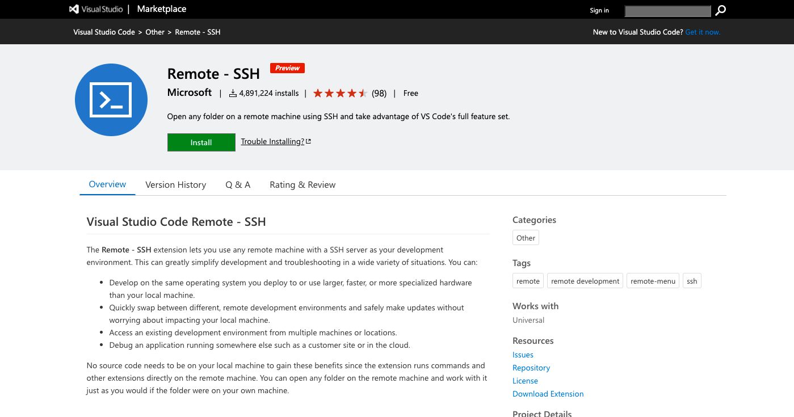
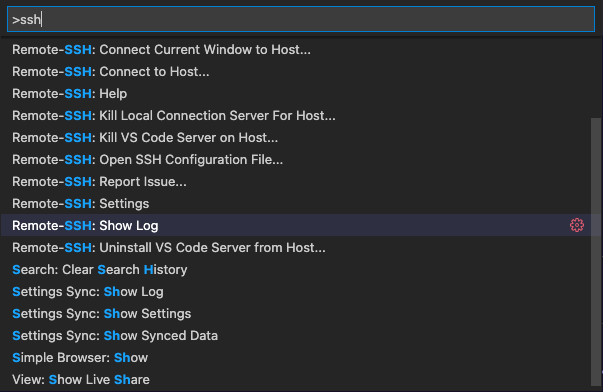
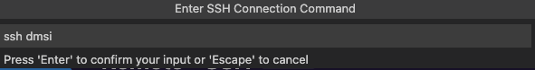
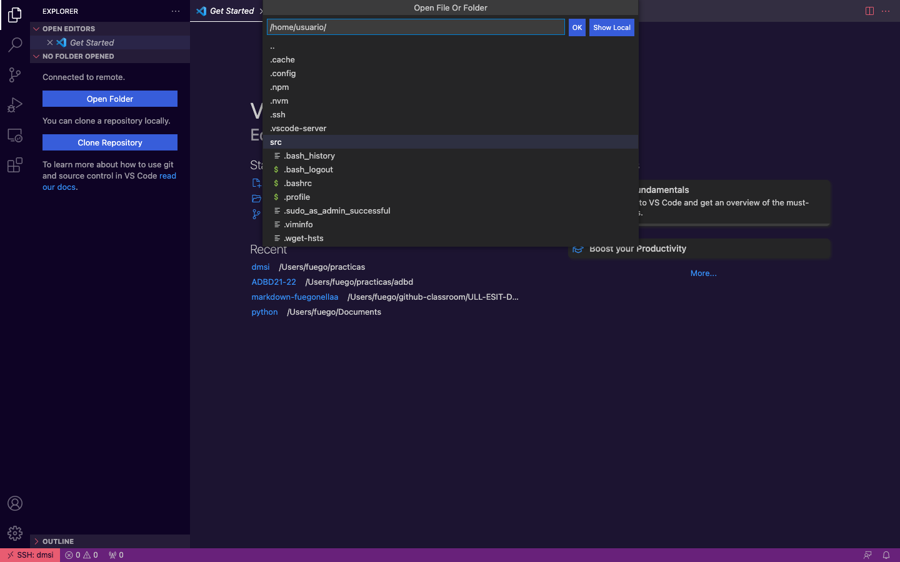
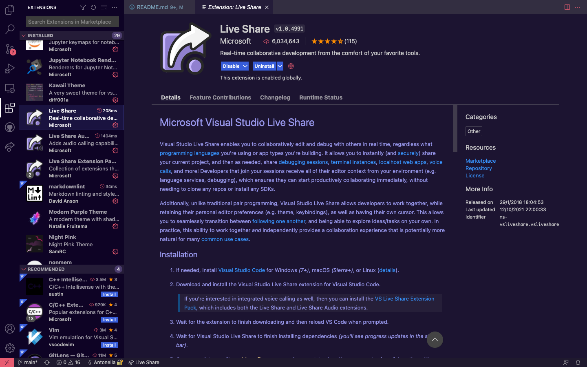
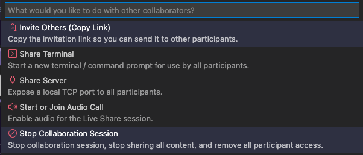
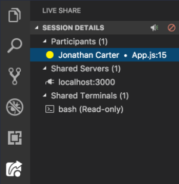
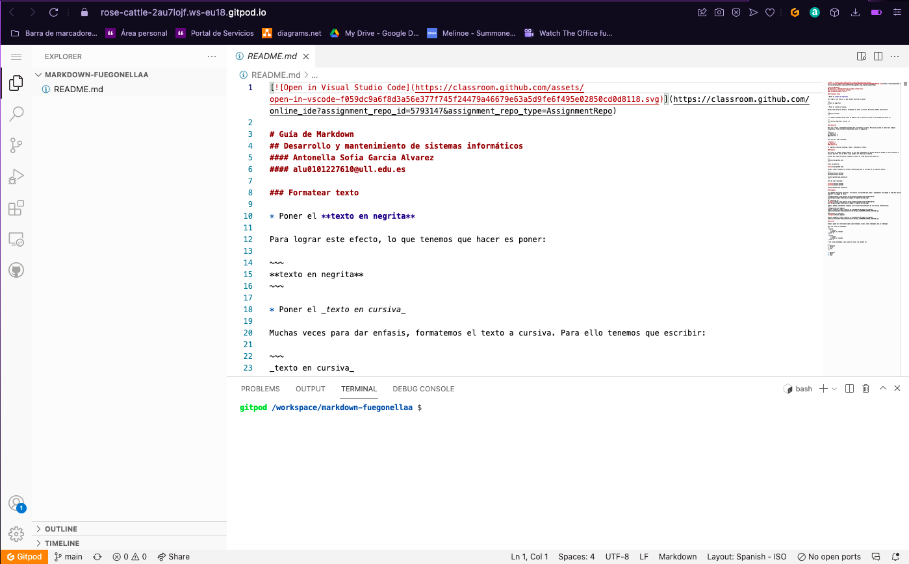

# Guía del usuario para VS Code y Gitpod
### Desarrollo y Mantenimiento de Sistemas de la Información
##### Antonella Sofía García Álvarez
##### alu0101227610@ull.edu.es

## Visual Studio Code
VS Code es un entorno creado por Microsoft para editar texto, es bastante _user-friendly_ y nos permite añadir bastantes extensiones que nos ayudarán a mejorar nuestra experiencia, además tiene muchisimas funciones de personalización.
 
 Visual tiene un sistema de edición bastante cómodo, nos muestra en que línea estamos, en que espacio, nos permite personalizar la identación y dependiendo del lenguaje en el que escribamos también personalizará la diferencia de colores en el texto.
 
 A diferencia de otros editores de texto, VS Code tiene extensiones. Esto significa que podemos instalar herramientas que nos ayudarán a mejorar la experiencia de uso. Podemos instalar tanto temas, como soportes para lenguajes de programación e incluso existe la posibilidad de crear una extensión propia. Por ejemplo, el año pasado incluso se publicó una aplicación de citas implementada en VS Code para programadores que podemos encontrar en el Marketplace de VS Code.

También, como mencioné antes, se pueden implementar temas. Por ejemplo, si te gusta programar en un entorno más oscuro o más claro puedes hacerlo facilmente. Por ejemplo:

[git history](https://marketplace.visualstudio.com/items?itemName=donjayamanne.githistory)

Pasando al tema de github también existe una extensión que nos facilita bastante el tema de los commit y los push. Como veremos en la siguiente imagen, nos va diciendo que cambios tenemos y que commits llevamos viendo las ramas de forma clara. Personalmente también tengo una extensión llamada git history que nos permite ver con más detalle las confirmaciones, como cuando hacemos un:

`git log --graph --all --decorate`

Hablando más sobre las extensiones es interesante mencionar dos que suelen ser fundamentales, y las utilizamos mucho durante el grado. Al menos en mi caso, estas son:

* SSH Remote
* liveshare

SSH Remote es una extensión creada por Microsoft que nos permite abrir una máquina de forma remota como bien dice su nombre. Para nosotros es útil porque utilizamos una máquina remota en el entorno IAAS de la Universidad de La Laguna y estas máquinas no disponen de entorno visual, utilizar esta extensión nos facilita el desarrollo de las prácticas que tenemos que entregar.

Para configurarlo debemos entrar en la consola de comandos de VS Code presionando _F1_ y allí debemos elegir la opción que mejor nos venga dentro de las disponibles:

Yo, presionaré la opción de ver la configuración del ssh para añadir como HOST mi máquina del IAAS, y una vez hecho eso añadiendo la IP y habiendo configurado el SSH desde la máquina intentaré conectarme a la máquina presionando _SSH Add new Host_:

Como vemos la configuración ha funcionado y si presionamos connect, nos llevará a una nueva ventana con los directorios de nuestra máquina remota:

También mencioné antes la extensión de liveshare, esta nos permite trabajar en un fichero de forma remota con colaboradores en tiempo real.

Funciona presionando la extensión y creará una nueva sesión dandonos entas opciones para trabajar en equipo, hace poco incluso se ha añadido la opción de hacer llamadas de voz para entenderse mejor:

Una vez compartida la sesión, podremos ver quien se ha unido a la izquierda, junto con la información de en qué fichero y en qué directorio estamos trabajando.

## Gitpod

Gitpod es un entorno para editar texto, igual que Visual Studio, que nos permite trabajar en el navegador en cualquier dispositivo sobre un repositorio de git.

Para usarlo, debemos crear una cuenta y vincularla con nuestra cuenta de github, dando los permisos pertinentes. Una vez creada, y eligiendo el plan de uso gratuito, podemos utilizarlo inmediatamente. Tiene las mismas funcionalidades que Visual Studio, incluso tiene la misma estética. Sin embargo, la ventaja es que se puede trabajar en el navegador de cualquier dispositivo.

