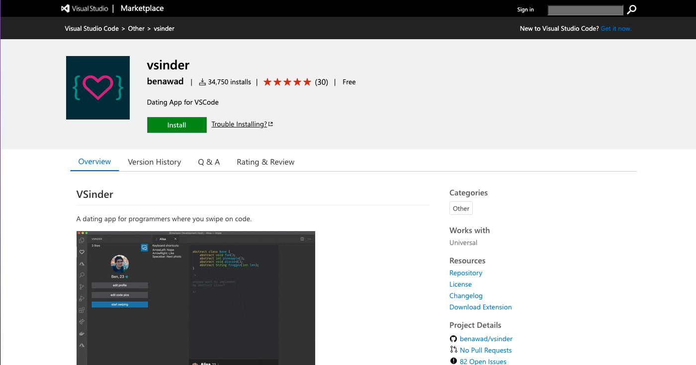
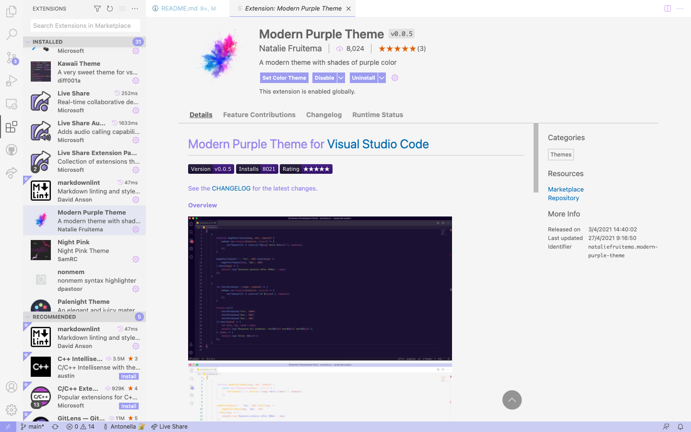
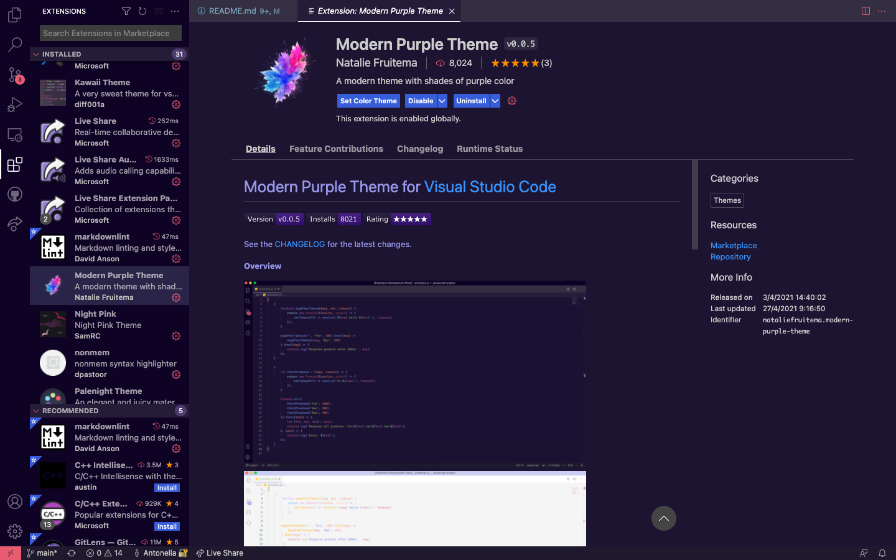
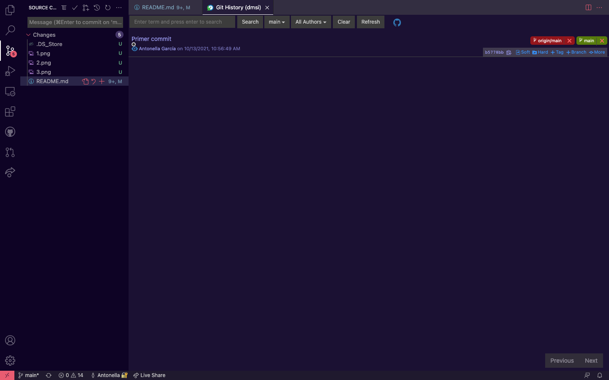

# Guía del usuario para VS Code y Gitpod
### Desarrollo y Mantenimiento de Sistemas de la Información
##### Antonella Sofía García Álvarez
##### alu0101227610@ull.edu.es

## Visual Studio Code
VS Code es un entorno creado por Microsoft para editar texto, es bastante _user-friendly_ y nos permite añadir bastantes extensiones que nos ayudarán a mejorar nuestra experiencia, además tiene muchisimas funciones de personalización.

#### Editor
 
 Visual tiene un sistema de edición bastante cómodo, nos muestra en que línea estamos, en que espacio, nos permite personalizar la identación y dependiendo del lenguaje en el que escribamos también personalizará la diferencia de colores en el texto.
 
 A diferencia de otros editores de texto, VS Code tiene extensiones. Esto significa que podemos instalar herramientas que nos ayudarán a mejorar la experiencia de uso. Podemos instalar tanto temas, como soportes para lenguajes de programación e incluso existe la posibilidad de crear una extensión propia. Por ejemplo, el año pasado incluso se publicó una aplicación de citas implementada en VS Code para programadores que podemos encontrar en el Marketplace de VS Code.

También, como mencioné antes, se pueden implementar temas. Por ejemplo, si te gusta programar en un entorno más oscuro o más claro puedes hacerlo facilmente. Por ejemplo:

[git history](https://marketplace.visualstudio.com/items?itemName=donjayamanne.githistory)

Pasando al tema de github también existe una extensión que nos facilita bastante el tema de los commit y los push. Como veremos en la siguiente imagen, nos va diciendo que cambios tenemos y que commits llevamos viendo las ramas de forma clara. Personalmente también tengo una extensión llamada git history que nos permite ver con más detalle las confirmaciones, como cuando hacemos un:

`git log --graph --all --decorate`

